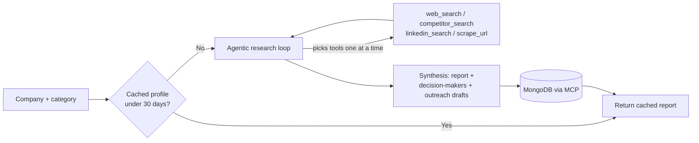

<div align="center">

# IntelBox

**Self-hosted, autonomous market intelligence and outreach research.**


</div>

> **Under active development.** Features, APIs, workflows, and architecture may change as the
> project evolves. Not yet production-ready.

---

## What it does

Give IntelBox a company name and a category. It researches the company, maps its competitors,
finds decision-makers, and drafts outreach — persisting everything to MongoDB so repeat runs are
cheap and reports build on prior context.

Rather than a manually-wired workflow where you configure which providers run for every request,
IntelBox runs an **autonomous agent** that decides which research a given company actually needs.
A quick brand-perception check might only trigger a web search; a full outreach-ready profile
also pulls in competitor mapping and decision-maker discovery — one tool call at a time, each one
informed by what the last call turned up.

Two more things shape the project:

- **Self-hosted, MIT-licensed.** No hosted product, no accounts, no telemetry. You run it, your
  data stays on your infrastructure.
- **Bring your own LLM.** Anthropic Claude, OpenAI, or Groq (free tier available) today, behind a
  provider-neutral interface built so adding another one doesn't touch the orchestrator.

---

## Table of contents

- [How it works](#how-it-works)
- [Features](#features)
- [Quick start](#quick-start)
- [Configuration](#configuration)
- [Repository structure](#repository-structure)
- [Demo targets](#demo-targets)
- [Deployment](#deployment)
- [License](#license)

---

## How it works



1. **Cache check.** If a fresh company profile (< 30 days old) already exists in MongoDB, it's
   returned immediately — no research is re-run.
2. **Agentic research loop.** Otherwise, the configured LLM decides which tools to call —
   `web_search`, `competitor_search`, `linkedin_search`, `scrape_url` — one at a time, reacting to
   each result before deciding the next call. Every call is emitted as a live status step.
3. **Skills.** Procedural guidance for the agent's two jobs — market research and decision-maker
   outreach — lives in `agent/skills/` as separate markdown files loaded into its system prompt.
4. **Synthesis.** Once research is sufficient, the same BYO-LLM interface produces the final
   report, a campaign playbook, decision-maker records, and outreach drafts.
5. **Persistence.** Everything is written to MongoDB through a separate MCP server (JSON-RPC),
   not an in-process driver — `mcp/operations.py` is the only place that talks to it directly.

Full diagram and notes: [`docs/architecture.md`](docs/architecture.md).

---

## Features

### Implemented

| Area | What's there |
|---|---|
| Orchestration | Agentic tool-calling loop — the model decides which tools to call and when, not a fixed fan-out |
| LLM | BYO-LLM interface (`agent/llm/`) — Anthropic Claude, OpenAI, or Groq, via `LLM_PROVIDER` or auto-detected from whichever API key is set |
| Skills | Procedural research guidance (`agent/skills/`) loaded into the agent's system prompt |
| Web search | Self-hosted SearXNG, structured/parsed JSON results — no per-query API cost |
| Decision-makers & outreach | Exa-backed LinkedIn search and outreach draft generation, with a fallback path |
| Scraping | Firecrawl, with a Jina Reader fallback |
| Persistence | MongoDB via a separate MCP server, with a 30-day company-profile cache |
| Status tracking | Live run-status stepper — the frontend polls while the backend streams step-by-step updates |
| Frontend | React + Vite, no router/state library |

### In progress / known gaps

- The outreach tracker (`POST /track`) accepts manual status updates from the frontend; automated
  follow-up detection (`IntelBoxRepository.find_follow_ups_due`) exists but nothing calls it yet
- Report and campaign-playbook synthesis is a single LLM call producing a flat markdown report —
  no structured market analysis (Porter's Five Forces, TAM/SAM/SOM, etc.)
- Test coverage is thin; the SearXNG integration test requires a live local instance
- `google-genai` is listed as a dependency but isn't wired into any code path — vestigial from an
  earlier iteration

### Planned

- Multi-user support
- Authentication and authorization
- Additional research providers and LLM adapters
- CRM integrations

---

## Quick start

### Backend

```bash
python -m venv .venv
source .venv/bin/activate
pip install -r requirements.txt

cp .env.example .env   # then fill in at least one LLM key

uvicorn api.main:app --reload
```

### Frontend

```bash
cd frontend
npm install
npm run dev
```

### Local dependencies for a full end-to-end run

- **SearXNG** for web search:
  ```bash
  docker compose -f deployment/docker-compose.yml up searxng
  ```
  The compose file mounts `deployment/searxng/settings.yml`, which enables the JSON output format
  `web_search.py` requires. A SearXNG instance run some other way needs the same setting.
- **A MongoDB MCP server** for persistence (`MONGODB_MCP_SERVER_URL`).

Without an LLM provider configured, the orchestrator falls back to calling all four research
tools once instead of letting the agent decide.

### Tests

```bash
pytest                          # full suite
pytest tests/test_api.py        # single file
pytest tests/test_api.py::test_healthcheck   # single test
```

---

## Configuration

```env
# LLM -- bring at least one. LLM_PROVIDER forces a choice; otherwise Anthropic is preferred,
# then OpenAI, then Groq, based on whichever key is set.
ANTHROPIC_API_KEY=
OPENAI_API_KEY=
GROQ_API_KEY=
LLM_PROVIDER=

# Research tools
EXA_API_KEY=
FIRECRAWL_API_KEY=

# Database
MONGODB_URI=
MONGODB_DATABASE=intelbox
```

Optional:

```env
SEARXNG_URL=http://localhost:8080
MONGODB_MCP_SERVER_URL=http://localhost:8001/mcp
```

`GOOGLE_API_KEY` / `GOOGLE_CLOUD_PROJECT` also appear in `.env.example` but aren't read by any
current code path.

---

## Repository structure

```text
agent/        Agentic orchestrator, BYO-LLM interface, procedural skills, and tool adapters
api/          FastAPI routes and service endpoints
mcp/          MongoDB MCP client integrations
models/       Shared Pydantic data models
pipeline/     Orchestration and persistence workflow
output/       Report and playbook generation
frontend/     React application
docs/         Architecture and documentation
deployment/   Deployment configurations
tests/        Test suites
```

---

## Demo targets

Current development testing uses:

| Company | Category |
|---|---|
| Nike | Sportswear |
| Zepto | Quick commerce |
| Taj Hotels | Hospitality |

Expected output: a market intelligence report, competitor analysis, decision-maker discovery,
outreach drafts, and MongoDB-backed persistence — with no code or schema changes needed between
categories.

---

## Deployment

Self-hosted only — there's no hosted IntelBox product. Deployment assets are included but should
be considered experimental until the first stable release.

- Docker Compose configuration (includes SearXNG)
- Cloud Run deployment configuration
- Architecture documentation ([`docs/architecture.md`](docs/architecture.md))

---

## License

MIT — see [`LICENSE`](LICENSE).
