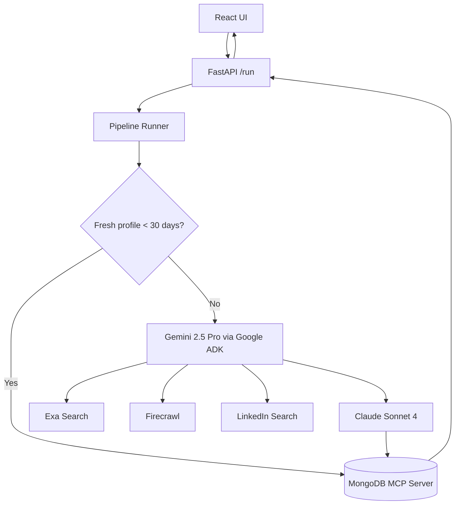

# ClientIQ Architecture

```mermaid
flowchart TD
    UI[React UI] --> API[FastAPI /run]
    API --> Runner[Pipeline Runner]
    Runner --> Cache{Fresh profile < 30 days?}
    Cache -->|Yes| Mongo[(MongoDB MCP Server)]
    Cache -->|No| Orchestrator[Gemini 2.5 Pro via Google ADK]
    Orchestrator --> Search[Exa Search]
    Orchestrator --> Scrape[Firecrawl]
    Orchestrator --> People[LinkedIn Search]
    Orchestrator --> Claude[Claude Sonnet 4]
    Claude --> Mongo
    Mongo --> API
    API --> UI
```
