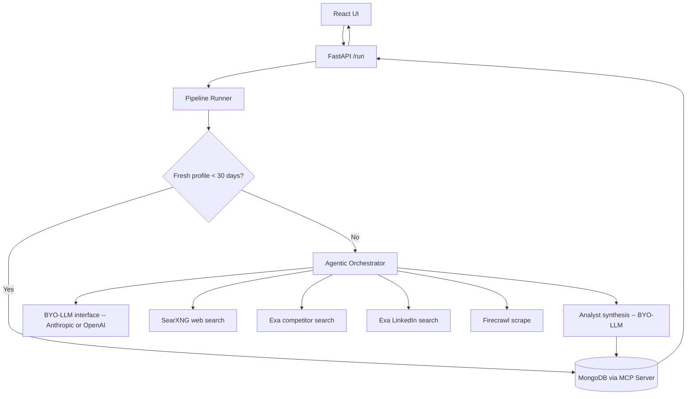

# IntelBox Architecture

The orchestrator (`agent/orchestrator.py`) runs a genuine tool-use loop: the configured LLM
decides which of `web_search`, `linkedin_search`, `competitor_search`, `scrape_url` to call, one
at a time, reacting to each result before deciding the next call -- not a fixed fan-out that calls
every tool on every run. Which LLM answers those calls is decided by `agent/llm/`
(`LLM_PROVIDER`, or whichever API key is set), not hardcoded to one provider. If no LLM provider
is configured, the orchestrator falls back to calling all four tools once instead.
